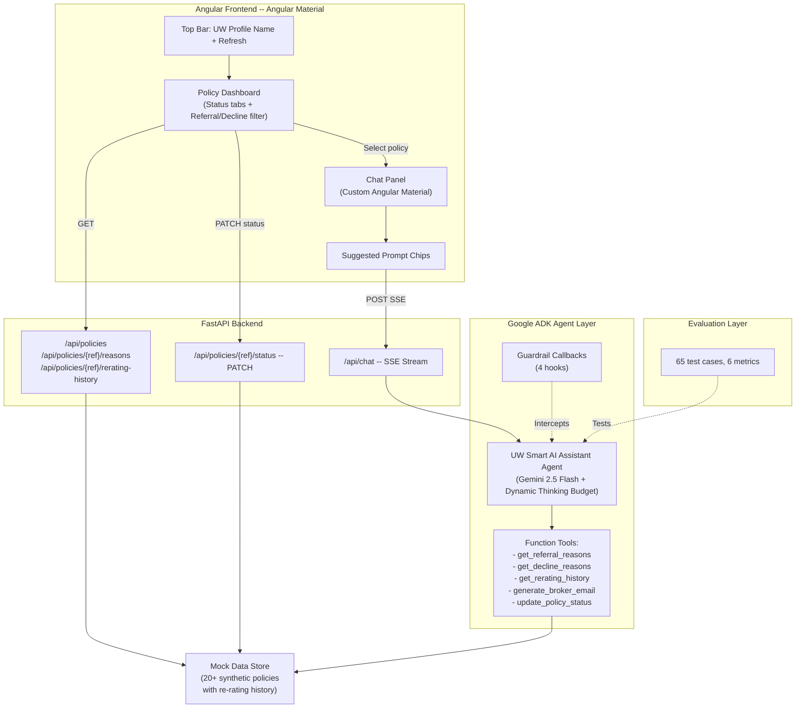
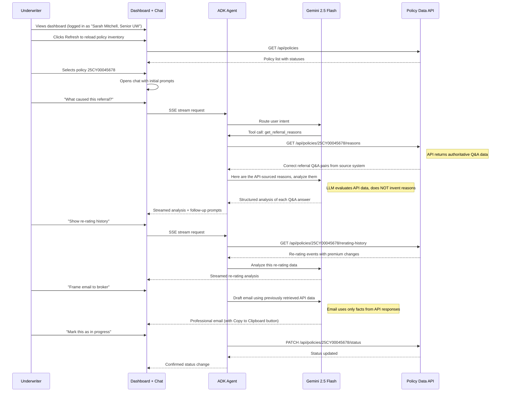

# UW Smart AI Assistant -- System Design Plan

## Vision

An agentic AI portal where underwriters view referral and decline policies, manage policy review status (Review / In Progress / Completed), and interact with an AI assistant through a conversational chat interface.

**Core design principle:** The API is the single source of truth for all policy data -- referral reasons, decline reasons, re-rating history, and premium details. The LLM never generates or invents reasons. Instead, the agent calls the API tool to retrieve the correct, authoritative data, then the LLM analyzes, evaluates, and presents those API-sourced facts to the underwriter in a clear and actionable format. Re-rating history and premium details are surfaced exclusively through chat (not on the dashboard table).

---

## Architecture



## User Flow



---

## Tech Stack

- **Frontend**: Angular 17 + Angular Material (custom chat UI with `mat-table`, `mat-chip-set`, `mat-card`, `mat-toolbar`, `ngx-markdown`)
- **Backend**: FastAPI (async, SSE streaming)
- **Agent Framework**: Google ADK (own event-driven runtime -- not LangChain/LangGraph)
- **LLM**: Gemini 2.5 Flash with dynamic thinking budget
- **Language**: Python 3.10+
- **Mock Data**: Synthetic specialty commercial line policies with re-rating history
- **Auth**: Hardcoded UW profile (name, role) -- pluggable for real auth later

---

## Model Selection Rationale

**Choice: Gemini 2.5 Flash with dynamic `thinking_budget`** -- not Flash-Lite, not a fixed reasoning level.

**Why not Flash-Lite (minimal reasoning)?**

The API returns correct, structured data -- but the LLM must do more than relay it. It performs three tasks that require medium-to-high reasoning:

- **Evaluate API-sourced Q&A answers**: The API returns the raw Q&A pairs (e.g., "Annual revenue?" -> "$500M"). The LLM must infer and explain *why* that specific answer triggered the referral in the context of Professional Liability underwriting guidelines. This is domain inference, not summarization.
- **Multi-tool routing**: Distinguish "why was this flagged?" from "show re-rating history" from "draft an email" -- routing to the correct API tool based on ambiguous user phrasing.
- **Email composition from API data**: Using only the facts returned by the API, compose a diplomatically worded broker email while intentionally omitting internal underwriting thresholds. The LLM must select which API-sourced facts to include and how to frame them professionally.

The key benchmark gap: GPQA (expert-level QA) -- Flash scores 78.3% vs Flash-Lite at 63.0%. This 15-point gap directly impacts the quality of insurance Q&A evaluation.

**Dynamic Thinking Budget (best of both worlds):**

Instead of choosing one fixed reasoning level, we adjust per task:

- Tool routing (simple): `thinking_budget=0` -- runs at Flash-Lite cost ($0.60/1M output)
- Q&A evaluation: `thinking_budget=4096` -- moderate reasoning ($3.50/1M output)
- Email generation: `thinking_budget=8192` -- full reasoning ($3.50/1M output)

**Cost projection:** ~$0.004 per conversation. ~$40/month at 10,000 conversations.

**Latency:** ~600ms to first visible streaming token.

---

## Orchestration -- ADK, Not LangChain/LangGraph

Google ADK has its **own runtime**. It does not wrap or depend on LangChain or LangGraph.

- **Runner** orchestrates execution via an event loop
- **Agents** yield `Event` objects; the Runner processes state and streams output
- **SessionService** manages persistent conversation state across turns (database-backed for chat history persistence)
- **Function Tools** are plain Python functions -- ADK auto-generates the schema from type hints and docstrings
- Communication to Gemini is direct HTTP via the `google-genai` SDK

---

## Why Not MCP

MCP (Model Context Protocol) is supported by ADK via `McpToolset`, but is **not used in this design** because:

- Tools are Python functions running **in-process** with the agent (~10ms latency)
- Adding MCP introduces a separate server process, network transport, and serialization overhead (~50-100ms latency)
- Single agent, single client -- no need for a standardized cross-agent tool interface
- Mock data store is local -- no external system to bridge

**MCP-ready design:** If the policy API moves to an external system or other teams' agents need access to these tools, converting is a one-line config change in the agent definition -- swap `tools=[function]` for `tools=[McpToolset(server)]`.

---

## Guardrails

Four ADK callback hooks, each with a specific insurance-domain purpose:

- **`before_model_callback`**: Blocks off-topic requests (non-underwriting), prevents PII extraction, logs for audit
- **`before_tool_callback`**: Validates policy reference format (`^\d{2}[A-Z]{2}\d{8}$`), enforces session rate limits (max 20 tool calls)
- **`after_model_callback`**: Detects hallucinated policy details (any fact in the response that was NOT present in the API tool response is flagged), redacts internal underwriting thresholds from broker-facing emails, validates professional tone
- **`after_tool_callback`**: Sanitizes API responses before passing to LLM, removes internal system fields, logs results for eval

Plus Gemini built-in safety filters at `BLOCK_MEDIUM_AND_ABOVE` for all harm categories.

---

## Evaluation Framework

**65 test cases across 6 datasets:**

- 15 referral analysis queries
- 15 decline analysis queries
- 10 re-rating history and premium analysis queries
- 10 broker email generation scenarios (with and without re-rating context)
- 10 edge cases (invalid refs, off-topic, adversarial prompts, status update validation)
- 5 multi-turn conversation scenarios (full flow: analysis, re-rating, email, status update)

**6 metrics with concrete targets:**

- `tool_trajectory_avg_score` (EXACT match): >= 95% -- correct tool called with correct arguments
- `response_match_score` (ROUGE-1): >= 0.70 -- key facts from tool data present in response
- `final_response_match_v2` (LLM-judged semantic): >= 0.85 -- meaning matches reference even if words differ
- `hallucinations_v1`: <= 5% -- every fact in the response must trace back to API tool output; any reason, amount, or detail not present in the API response is a hallucination
- `safety_v1`: 100% -- zero tolerance for harmful content
- Custom `email_quality_rubric`: >= 0.80 -- professional tone, accurate reasons, re-rating context when relevant, no internal thresholds leaked

Run with: `adk eval --config evals/test_config.json`

---

## UI Design

### Top Bar (Header)

- Hardcoded UW profile: **"Sarah Mitchell, Senior Underwriter"** with avatar placeholder
- Application title: **"UW Smart AI Assistant"**
- Refresh button (mat-icon-button with `refresh` icon) -- reloads policy inventory table only (UI-level refresh, re-fetches GET /api/policies)

### Policy Dashboard (Home Page)

**Search and filter bar** above the table:

- Search input (filters by policy ref, insured name, or broker)
- Line of business dropdown filter (mat-select)

**Three status tabs** below search bar (mat-tab-group):

- **Review** -- policies awaiting underwriter review (default tab)
- **In Progress** -- policies the UW is actively working on
- **Completed** -- policies fully reviewed

**Within each tab**, a mat-table with columns:

- Policy Ref (e.g., `25CY00045678`)
- Insured Name
- Line of Business
- Broker
- Type (Referral / Decline) -- with color-coded chip
- Submission Date
- Status dropdown (can change status inline from UI)

Note: Re-rating count and premium are intentionally NOT shown in the table. These details are surfaced through the AI chat when the UW selects a policy, keeping the dashboard clean and focused on policy identification and workflow status.

Row click opens the chat panel for that policy.

### Chat Panel (Slide-in Side Panel)

- Header: policy ref, insured name, current status badge
- Message area: scrollable, user messages right-aligned, assistant left-aligned, markdown rendered
- Dynamic suggested prompt chips based on conversation state and policy type
- SSE streaming with typing indicator
- "Copy to Clipboard" button on AI-generated broker emails
- Persistent chat history per policy -- UW can close the panel, come back later, and resume the conversation where they left off (backed by database-persisted ADK sessions)

**Initial prompts (shown when chat opens for a policy):**

All prompts are available from the start. The first set is contextual based on policy type, the rest are always visible:

- Referral policy: "What caused this referral?" / "Show re-rating history" / "What is the current premium?" / "How many times was this re-rated?"
- Decline policy: "What caused this decline?" / "Show re-rating history" / "What were the premium changes?" / "How many times was this re-rated?"

**Follow-up prompts (appear after initial analysis):**

- "Frame email to broker" / "Summarize key risk factors" / "Show premium progression"

**Action prompts (appear after email or analysis):**

- "Mark as In Progress" / "Mark as Completed" / "Any other concerns?"

---

## Mock Data Design

**Policy reference pattern**: `{YY}{LOB}{NNNNNNNN}` (e.g., `25PL00012345`)

- `YY` = 2-digit year
- `LOB` = 2-character line of business code
- `NNNNNNNN` = 8-digit sequential number

**Specialty commercial lines**: PL (Professional Liability), DO (Directors and Officers), EO (Errors and Omissions), CY (Cyber Liability), MC (Marine Cargo), EL (Environmental Liability), AV (Aviation), XS (Excess and Surplus)

**20+ synthetic policies**, each containing:

- Core fields: policy ref, insured name, broker, line of business, type (referral/decline), submission date, current premium, status (review/in_progress/completed), assigned UW
- 3-6 underwriting Q&A pairs that triggered the referral or decline, each with severity level
- Re-rating history: 0-4 re-rating events per policy, each with timestamp, reason for re-rating, premium before, premium after, and what changed
- Split: ~12 referral policies, ~10 decline policies, distributed across all lines and statuses

**Sample re-rating history entry:**

```json
{
  "rerate_number": 2,
  "date": "2025-09-20",
  "reason": "Broker provided updated loss runs showing improved claims trend",
  "premium_before": 185000,
  "premium_after": 162000,
  "changes": ["Loss ratio adjusted from 78% to 62%", "Experience modifier reduced"]
}
```

---

## Agent Tools (5 Function Tools)

Each tool calls the backend API which returns **authoritative, correct data**. The LLM receives this data and analyzes/presents it -- it never generates reasons or facts on its own.

- **`get_referral_reasons(policy_ref: str)`** -- calls `GET /api/policies/{ref}/reasons`. API returns the exact Q&A pairs (questions asked, answers given, severity levels) that triggered the referral in the source system. LLM then evaluates each answer to explain why it was flagged.
- **`get_decline_reasons(policy_ref: str)`** -- calls `GET /api/policies/{ref}/reasons`. API returns the exact Q&A pairs and risk flags that caused the decline. LLM analyzes these to explain the risk assessment to the UW.
- **`get_rerating_history(policy_ref: str)`** -- calls `GET /api/policies/{ref}/rerating-history`. API returns re-rating count, each event (timestamp, reason, premium before/after, what changed), and premium trajectory. LLM summarizes the pattern and premium movement.
- **`generate_broker_email(policy_ref: str, include_rerating: bool)`** -- does NOT call an API. Instead, the LLM uses the previously retrieved API data (referral/decline reasons, optionally re-rating history) already in the session context to compose a professional email. The email content is grounded strictly in API-sourced facts.
- **`update_policy_status(policy_ref: str, new_status: str)`** -- calls `PATCH /api/policies/{ref}/status`. Changes policy status (review/in_progress/completed). Callable from both UI and chat.

---

## API Endpoints

- `GET /api/policies` -- list all policies (filterable by status, type)
- `GET /api/policies/{ref}` -- single policy detail
- `GET /api/policies/{ref}/reasons` -- referral or decline Q&A data
- `GET /api/policies/{ref}/rerating-history` -- re-rating events and premium progression
- `PATCH /api/policies/{ref}/status` -- update status (body: `{ "status": "in_progress" }`)
- `POST /api/chat` -- SSE streaming chat endpoint (body: `{ "session_id", "policy_ref", "message" }`)

---

## Project Structure

```
UW-AI-Assistant/
  backend/
    app/
      main.py                          # FastAPI entry point
      config.py                        # Env settings
      routers/
        policies.py                    # Policy CRUD + status endpoints
        chat.py                        # Chat SSE endpoint
      agents/uw_assistant/
        agent.py                       # ADK agent + thinking budget config
        tools.py                       # 5 function tools
        guardrails.py                  # 4 callback hooks
      data/
        mock_policies.py               # Synthetic policy data with re-rating history
        mock_qa_data.py                # Q&A pairs for referral/decline
      models/
        schemas.py                     # Pydantic request/response models
    evals/
      test_config.json
      datasets/                        # 6 eval datasets (65 test cases)
      rubrics/email_quality.txt
    requirements.txt
    .env.example
  frontend/
    src/app/
      pages/home/                      # Policy dashboard page
      components/
        policy-table/                  # Policy table (no premium/re-rating columns)
        policy-search/                 # Search bar + LOB filter dropdown
        status-tabs/                   # Review / In Progress / Completed tabs
        chat-window/                   # Chat panel (Angular Material)
        chat-message/                  # Message bubbles with markdown + copy button
        chat-prompts/                  # Initial, follow-up, and action prompt chips
        uw-header/                     # Top bar with UW profile + refresh
      services/
        policy.service.ts              # Policy API + status update client
        chat.service.ts                # SSE streaming client
      models/
        policy.model.ts                # Policy, ReratingEvent, QAPair interfaces
        chat.model.ts                  # ChatMessage, PromptSuggestion interfaces
    angular.json
    package.json
  PLAN.md                              # This document
  README.md
```

---

## Future Extensibility

- **MCP integration**: When policy data moves to an external system, wrap it in a `FastMCP` server and swap the agent's tool config -- one-line change in agent definition
- **Multi-agent**: ADK supports `SequentialAgent` and `ParallelAgent` -- add a dedicated email agent or a document retrieval agent as sub-agents
- **Vertex AI sessions**: Migrate from local SQLite-backed sessions to Vertex AI managed sessions for production scale
- **User simulation testing**: ADK v1.18.0+ supports `ConversationScenario` for automated multi-turn eval without rigid scripts
- **Real authentication**: Replace hardcoded UW profile with Azure AD / Google OAuth; add role-based access control
- **Audit trail**: Persist all chat interactions and status changes to a database for compliance
